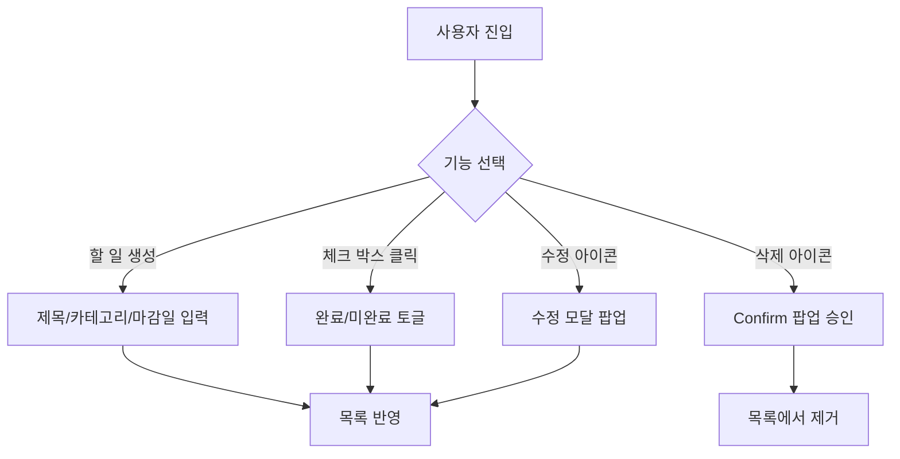

# 📋 Product Requirement Document (PRD)
## 프로젝트: Todo List Mini (Tania's Todolist)

본 문서는 리액트(React) 기반으로 구현된 **Todo List Mini (Tania's Todolist)** 프로젝트의 제품 요구사항 및 상세 사양을 명확하고 체계적으로 기술한 문서입니다.

---

## 📌 1. 프로젝트 개요 (Overview)

| 항목 | 상세 내용 |
| :--- | :--- |
| **서비스명** | Tania's Todolist (Todo List Mini) |
| **개발 스택** | React (Vite) + Vanilla CSS |
| **핵심 목적** | 사용자가 일상 및 업무 계획을 효율적으로 분류·정렬·검색하고 직관적으로 관리할 수 있는 모던한 웹 서비스 제공 |
| **타겟 고객** | 일일 업무, 개인 학습, 쇼핑 리스트 등 단기 계획을 빠르고 체계적으로 관리하고 싶은 유저 |

---

## 🎯 2. 제품 목표 및 비전 (Goals & Vision)

> **"복잡하지 않게, 그러나 필요한 모든 기능을 감각적인 UI에 담다"**

1. **UX 심플화**
   * 한 번의 클릭으로 할 일 추가/수정 모달에 접근하고 직관적으로 정보를 수정할 수 있는 플로우 구축
2. **다각도 필터링 및 관리의 유연성**
   * 카테고리별 분류, 진행 상태 필터, 다각도 정렬 옵션을 조합하여 본인 맞춤형 리스트 뷰 확인 가능
3. **프리미엄 UI/UX 테마 시스템**
   * 동적 라이트/다크 모드 제공과 더불어 글래스모피즘(Glassmorphism) 및 부드러운 전환 효과를 가미한 고급스러운 비주얼 선사

---

## ⚙️ 3. 핵심 기능 사양 (Core Specifications)

### 3.1. 사용자 인터페이스 레이아웃 (UI/UX Layout)

#### 📂 좌측 사이드바 (Sidebar)
* **로고 & 타이틀**: 브랜드 아이덴티티 및 명칭 표시
* **할 일 추가 버튼**: 주요 행동 유도(CTA) 버튼 배치 (모달 팝업 연결)
* **카테고리 네비게이션**: 
  * '전체' 및 개별 카테고리(`📖 공부`, `💼 업무`, `🏃 운동`, `🛒 쇼핑`, `💬 기타`) 리스트
  * 각 카테고리 옆에 등록된 할 일 개수가 실시간으로 반영되는 **카운트 배지** 제공
* **상태 필터**: `전체` / `진행 중` / `완료` 필터 스위치 제공
* **정렬 드롭다운**: 사이드바 하단에서 리스트 정렬 조건 변경 지원

#### 💻 우측 메인 영역 (Main Content)
* **헤더 (Header)**: 오늘의 웰컴 문구 및 서브타이틀, **테마 전환 토글 버튼(☀️/🌙)**, 사용자 프로필 아이콘
* **검색 & 퀵 액션 바**: 실시간 타이핑을 통한 검색 기능 및 입력란 엔터/버튼 클릭 시 등록 모달 연결
* **카테고리 칩 필터**: 상단 탭 형태의 버튼을 눌러 카테고리간 빠른 시각적 필터 전환 지원
* **할 일 목록 카드**: 체크 여부에 따른 완성선 처리 및 세련된 테마 맞춤형 디자인 카드 리스트
* **현황 요약 푸터 (Footer)**: 전체/진행중/완료 현황을 하단에 시각적인 3구 스탯 박스로 출력

---

### 3.2. 할 일 관리 기능 (CRUD Operations)

* **생성 (Create)**: 텍스트 입력창 혹은 모달을 통해 할 일을 신규 등록합니다. (제목 필수, 카테고리/마감일 선택 가능)
* **조회 (Read)**: 입력된 카테고리별 색상 배지 및 마감 날짜(달력 아이콘 포함)를 보기 쉽게 렌더링합니다.
* **수정 (Update)**: 연필(`✏️`) 버튼 클릭 시 수정 전용 모달을 띄워 기존 입력값을 유지한 상태에서 손쉽게 데이터를 갱신합니다.
* **삭제 (Delete)**: 휴지통(`🗑️`) 버튼을 클릭하면 브라우저 Confirm 알림 확인을 거쳐 대상을 안전하게 지웁니다.

---

### 3.3. 검색, 필터 및 정렬 상세 사양 (Search, Filter, Sort)

* **실시간 검색**: 입력한 텍스트가 제목에 포함되어 있는지 즉시 필터링합니다. (대소문자 무시)
* **카테고리 & 상태 중복 필터링**:
  * 선택된 카테고리와 필터 상태(`전체`, `진행 중`, `완료`)의 교집합에 속하는 항목만 도출합니다.
* **정렬 로직**:
  1. `최신순`: 생성 시점(`createdAt`) 기준 역순 정렬
  2. `오래된순`: 생성 시점(`createdAt`) 기준 오름차순 정렬
  3. `마감일순`: 마감일(`deadline`) 오름차순 정렬 (마감 기한이 누락된 할 일은 가장 뒤에 배치됨)

---

### 3.4. 동적 테마 스위처 (Theme Switcher)

* **다크 모드 (기본값)**: 차콜과 딥 네이비 톤 조합으로 눈의 피로도를 낮추고 포인트 컬러를 강조한 다크 모드
* **라이트 모드**: 심플한 화이트와 연한 그레이톤의 깔끔하고 화사한 라이트 모드
* **구현 방식**: `document.documentElement`에 `theme-light` 또는 `theme-dark` 클래스를 추가/제거하여 정의된 CSS 변수값을 전체 테마에 동적으로 바인딩

---

## 🛠️ 4. 기술 스택 및 개발 구조 (Tech Stack)

* **라이브러리 & 빌드 툴**: `React` (v18.x), `Vite` (v5.x)
* **스타일링**: Vanilla CSS (CSS 변수 기반 디자인 시스템 적용)
  * [reset.css](file:///d:/git/study/todo-list-mini/todo-list-mini/src/assets/css/reset.css) - 전역 리셋 및 Pretendard 폰트 페이스 설정, 테마별 CSS 변수 선언부 포함
  * [todolist.css](file:///d:/git/study/todo-list-mini/todo-list-mini/src/assets/css/todolist.css) - 메인 레이아웃 및 각 컴포넌트 스타일링 규칙
* **상태 관리**: 컴포넌트 단위 로컬 state (`useState`) 및 이펙트(`useEffect`) 흐름 구성
* **핵심 컴포넌트**:
  * [App.jsx](file:///d:/git/study/todo-list-mini/todo-list-mini/src/App.jsx) - 전역 비즈니스 로직 및 컨테이너
  * [TodoModal.jsx](file:///d:/git/study/todo-list-mini/todo-list-mini/src/components/TodoModal.jsx) - 할 일 작성/편집을 위한 공통 모달 윈도우
